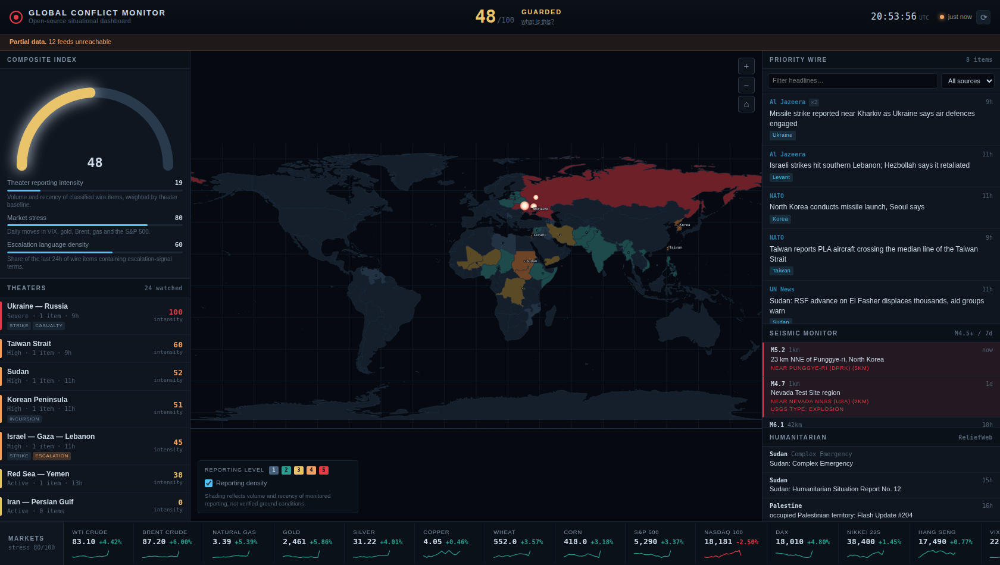
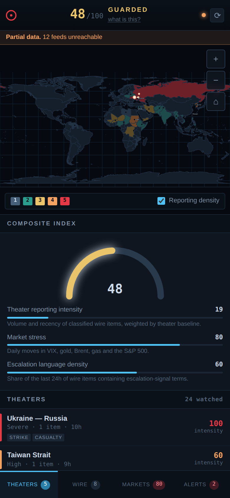

# Global Conflict Monitor

A war-room dashboard that aggregates open-source reporting on active conflicts:
a live newswire, geolocated reporting density on a world map, market stress,
humanitarian situation reports and seismic monitoring — in one screen.



<p align="center">
  
</p>

> **What this is.** An aggregation and visualisation tool for public reporting.
> Every number on it describes *what is being published* and *how markets moved*.
> It is not a measurement of conditions on the ground, and it does not predict
> anything. See [Reading the numbers](#reading-the-numbers).

---

## Running it

No build step, no runtime dependencies — the whole service is standard-library
Node.

```
npm start              # http://localhost:8080
npm test               # 50 unit + HTTP integration tests, no browser needed
npm run test:browser   # desktop rendering and interaction (needs Chromium)
npm run test:mobile    # small-screen layout across four phone/tablet viewports
npm run test:all       # everything
```

The browser tests need `playwright-core` (`npm install`) and a Chromium build;
they look for one under `/opt/pw-browsers`. The unit suite has no dependencies
at all.

## Deploying to Railway

The repo ships a Dockerfile and `railway.toml`. On [railway.app](https://railway.app):
**New Project → Deploy from GitHub repo**, pick this repo. Railway detects the
Dockerfile, injects `PORT`, and health-checks `/api/health`. Nothing else to
configure — there are no API keys to set.

---

## What it shows

**Composite index (0–100)** — a weighted blend of three observable components,
each shown with its own value and basis so the total can be checked against the
panels it came from.

**Theater watchlist** — 24 standing watch regions, ranked by current reporting
intensity, each with detected escalation-signal language and a drill-down.

**Map** — country shading and markers by theater level, plus a reporting-density
overlay built from GDELT's geolocated mention data. Pan, zoom, click a theater.

**Priority wire** — items from ~20 feeds, deduplicated across syndicating
outlets, ranked by recency, corroboration count, source weight and signal
language. Searchable and filterable by source lane.

**Markets** — energy, metals, agriculture, equity indices, VIX and FX, with
sparklines and a derived market-stress reading.

**Seismic monitor** — USGS M4.5+ events, flagging shallow events near known
nuclear test sites. Underground tests register as shallow seismic events, which
is how public reporting of them has historically broken first.

**Humanitarian** — active ReliefWeb disaster records and situation reports.

### On a phone

Below 1024px the three-column layout gives way to a pinned map plus a bottom
tab bar — **Theaters · Wire · Markets · Alerts** — showing one panel at a time,
with live badges for high-level theaters, wire volume, market stress and
flagged seismic events. The market ticker becomes a vertical list, and the
theater drawer goes full screen. `npm run test:mobile` asserts every tab
renders with usable height at four viewports, since a panel collapsing to zero
height is invisible to desktop tests.

---

## Reading the numbers

The methodology dialog in the app (`what is this?` in the header) states this
too, but the short version:

- **Reporting intensity tracks media attention, not violence.** It rises with
  news cycles and falls where journalists cannot operate. A quiet theater is not
  a safe one.
- **Theater levels are floored near a standing baseline** so an ongoing war does
  not read as resolved on a slow news day.
- **Classification is keyword-based** and makes occasional mistakes. Every item
  links to its source; read it.
- **Nothing here is predictive.** There is no model of intent, capability or
  escalation probability.
- **The seismic "explosion-like" flag is a geometry heuristic** (shallow depth +
  proximity to a known site). Natural earthquakes and mining blasts trip the
  same conditions; USGS's own `type` field is authoritative and is passed
  through unmodified.

---

## Data sources

All keyless and public.

| Source | Used for |
|---|---|
| ~20 RSS/Atom feeds (Al Jazeera, BBC, Guardian, France 24, DW, UN News, NATO, ISW, Defense News, regional desks) | Newswire |
| [GDELT 2.0](https://www.gdeltproject.org/) GEO + DOC APIs | Geolocated reporting density, coverage volume and tone |
| [Stooq](https://stooq.com) CSV endpoints | Market quotes and daily history |
| [ReliefWeb](https://reliefweb.int) (UN OCHA) API | Humanitarian reports and disaster records |
| [USGS](https://earthquake.usgs.gov) earthquake feed | Seismic events |
| [world-atlas](https://github.com/topojson/world-atlas) (Natural Earth 50m) | Vendored map geometry |

Feeds resolve independently and are cached with stale-while-revalidate, so one
dead upstream degrades a single panel rather than the board. The header shows a
`Partial data` banner and the methodology dialog lists per-source status.

---

## Architecture

```
server/
  index.js          HTTP server, routing, static serving, gzip, diagnostics
  config.js         Watch theaters, feeds, instruments, cache windows
  aggregate.js      Theater status, composite index, priority ranking
  lib/              cache (stale-while-revalidate), fetch (timeout/retry/
                    bounded concurrency), tolerant XML, CSV, classification
  sources/          news · gdelt · markets · reliefweb · seismic
public/
  index.html        Dashboard shell
  css/style.css     Dark war-room theme
  js/
    app.mjs         Boot, refresh cadences, wiring
    map.mjs         SVG map: viewBox pan/zoom, theaters, density overlay
    topo.mjs        TopoJSON decoder, equirectangular projection
    panels.mjs      Panel renderers
    util.mjs        Formatting and DOM helpers
  data/             Vendored world geometry
test/
  run.js            Unit + HTTP integration tests
  browser.js        Chromium smoke test
  fixture-fetch.js  Shared fixture router for upstreams
```

### Notes on a few decisions

- **Zero runtime dependencies.** Everything — the RSS parser, the CSV parser,
  the TopoJSON decoder, the HTTP server — is written against the standard
  library. No supply chain, no lockfile, no install step in the image.
- **`viewBox` pan/zoom rather than transforms.** Geometry stays in world
  coordinates and paths are never rebuilt; strokes and text stay crisp at every
  zoom level.
- **Antimeridian handling.** Rings that straddle 180° are unwrapped and drawn
  once per 360° shift, clamped to the map edge — otherwise Russia draws as a
  band across the entire map.
- **Untrusted content.** Feed text is third-party. It is only ever assigned via
  `textContent`; nothing in the client assigns `innerHTML` from response data.

## API

| Endpoint | Returns |
|---|---|
| `GET /api/overview` | Composite, theaters, priority wire, market board |
| `GET /api/wire?q=&lane=&theater=&limit=` | Filtered newswire |
| `GET /api/theater/:id` | Theater detail, drill-down and GDELT signal |
| `GET /api/markets` | Full market board with per-instrument series |
| `GET /api/geo` | Geolocated reporting density points |
| `GET /api/humanitarian` | ReliefWeb reports and disasters |
| `GET /api/seismic` | USGS events with test-site annotation |
| `GET /api/health` | Uptime, memory, per-key cache diagnostics |
| `GET /api/config` | Theater definitions |

---

## Licence

MIT. Data belongs to the respective sources listed above; check their terms
before redistributing.
